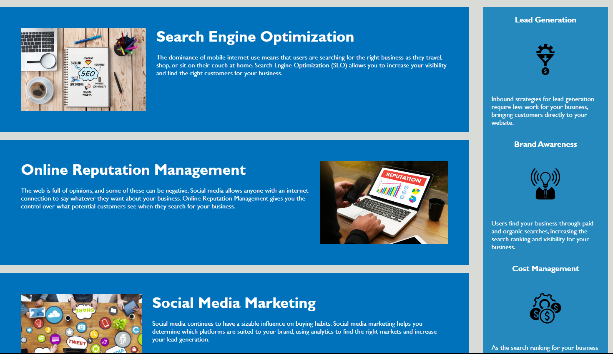

# HTML-CSS-refactor

About the Project

We wanted to edit the codebase for a webpage to hav eit follow accessibility standards, as well as optimize it for search engines.

This meant using semantic HTML elements, logical structure of styling and positioning, accessible alt attributes, and a concise and descriptive title.

Below we see a left side with several things that are the same and can share CSS styling. On the right side we have the same.

You can find the deployed application <a href="https://msusyr24.github.io/HTML-CSS-refactor/">here.</a>